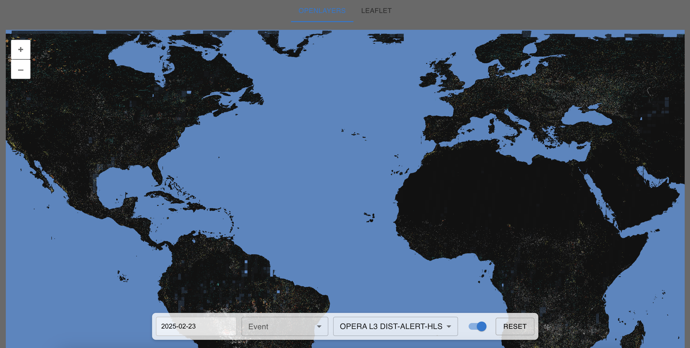

# 🌍 NASA HLS World Viewer

**Live App**: [World View App](https://heartfelt-jalebi-6947b2.netlify.app/)



A **React + OpenLayers + Redux** web application for exploring **NASA Harmonized Landsat Sentinel‑2 (HLS)** WMTS imagery from the **Global Imagery Browse Services (GIBS)**.

Supports:

- **Date Selection** – Pick a date to reload NASA HLS WMTS imagery (defaults to two days before today)  

- **Event Selection** – Choose events from a preloaded JSON file; map pans and zooms to event location with a marker  

- **Style Switching** – Switch between available NASA GIBS styles:  
  - `OPERA L3 DYNAMIC`  
  - `HLS MGRS GRANULE`  
  - `HLS L30 NADIR`  
  - `HLS S30 NADIR`  
  - `OPERA L3 DIST-ALERT-HLS`  
  - `OPERA L3 DIST-ANN-HLS`  

- **Layer Visibility Toggle** – Show or hide the HLS layer over the OSM base map  

- **Reset Button** – Resets date, style, visibility, and event selection to defaults, zooming back to world view  

- **Toast Notifications** – Displays success/failure when imagery tiles load or fail  


---

## Features

### NASA GIBS WMTS Integration
- Connects to the NASA Worldview WMTS endpoint.
- Loads **HLS S30/L30** and **OPERA L3** layers dynamically.
- Automatically parses NASA style identifiers from GetCapabilities.

### Redux State Persistence
- Caches:
  - Selected style
  - Selected date
  - Layer visibility  
- Cache refreshes automatically if older than **6 days**.

### Date Selection
- Pick a specific date to load imagery for that day.
- Automatically fetches the corresponding **HLS WMTS layer**.

### Event Selection
- Loads a large JSON dataset of events with coordinates.
- Smoothly pans and zooms to the selected event.
- Displays an **animated pulse marker** at the event location.

### Style Switching
- Switch between **True Color, False Color, Night Band**, and other NASA styles.
- Maps display names to correct WMTS identifiers automatically.

### Layer Visibility Toggle
- Toggle HLS imagery on/off.
- Switch between **HLS imagery** and **OSM base map** instantly.

### Reset Control
Resets the map to:
- **Date** → Two days before today  
- **Event selection** → None  
- **Style** → `HLS S30 NADIR`  
- **Layer visibility** → `true`  
- **Zoom** → World view  

### Toast Notifications
- **Success toast** when layers load successfully.
- **Error toast** if more than **50% of tiles fail** to load.

### Custom Zoom Controls
- Large, easy-to-use zoom buttons positioned at the **bottom-left**.

### Responsive UI
- Built with **Material UI (MUI)** for dropdowns and controls.
- Fully responsive across devices.

---

## Tech Stack

- **React** – Frontend framework  
- **Redux Toolkit + React Redux** – State management & caching  
- **OpenLayers** – Map rendering  
- **NASA GIBS WMTS** – Imagery source  
- **Material UI (MUI)** – UI components  
- **React DatePicker** – Date selection  
- **React Toastify** – Notifications  
- **Jest + React Testing Library** – Unit testing  

---

## Installation

Clone the repository and install dependencies:

```bash
git clone https://github.com/calcucool/NASAProject.git
cd nasa-map
npm install
```

## Running the Application

```bash
npm start
```

## Once the server starts, open in your browser:

```bash
http://localhost:3000
```

## Running Tests
```bash
npm test -- WorldViewOpenLayers
```
